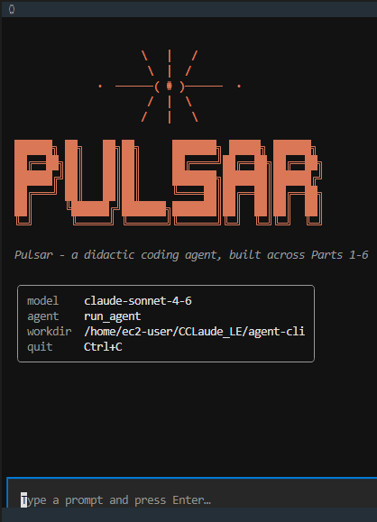

<div align="center">

# Pulsar

**A didactic, fully runnable coding agent — the anatomy of an agentic loop, in readable Python.**

Built across Parts 1–6 of the series *"Anatomy of an Agentic Loop"*, on top of the **Anthropic SDK**.

[](https://www.python.org/)
[](https://docs.anthropic.com/)
[](#tests-offline)
[](LICENSE)

</div>

---

Each module maps to one Part of the series and keeps the article's function names,
so the code reads as the articles do — just organised and actually runnable. It is
built to be **read**: clear, well-commented code is preferred over cleverness.

> `pulsar` is the Python package and CLI; **Pulsar** is also the name shown by the
> interactive TUI.



## Table of contents

- [Highlights](#highlights)
- [How it composes](#how-it-composes)
- [The six Parts](#the-six-parts)
- [Requirements](#requirements)
- [Setup](#setup)
- [Run](#run)
- [Tests (offline)](#tests-offline)
- [Sub-agents (Part 6)](#sub-agents-part-6)
- [Adding a new tool](#adding-a-new-tool)
- [Memory](#memory)
- [Configuration](#configuration)
- [Project layout](#project-layout)
- [Intended use & disclaimer](#intended-use--disclaimer)
- [License](#license)

## Highlights

- **A real agentic loop** — `run_agent` drives the model, executes tools, and feeds results back, Part by Part.
- **UI-agnostic core** — the loop *yields* typed events; a plain console and a Textual TUI consume the **same** stream, core unchanged.
- **Real tools, gated** — file and shell operations run for real in a scoped working directory, each cleared by an explicit permission chain.
- **File-based memory** — project- and user-scope `PULSAR.md`, in the Claude Code style.
- **Sub-agents** — `run_agent` applied recursively: read-only workers whose context lives and dies inside the call.
- **Offline test suite** — the whole thing runs without a network connection or an API key.

## How it composes

```
invoke("run_agent", prompt)              # call an agent by name + prompt
        │
        ▼  yields typed events
  run_agent (loop.py, Part 1)
     ├─ build_system_prompt   memory.py      (Part 5)
     ├─ compact_if_needed     context.py     (Part 4)
     ├─ check_permission      permissions.py (Part 3)
     ├─ execute_tool          tools/         (Part 2)
     └─ spawn_agent           subagents.py   (Part 6) → run_agent (recursive, distilled result)
        │
        ▼
  frontends/console.py   (plain console)   ┐ both consume the SAME
  frontends/tui.py       (Textual TUI)     ┘ event stream, core unchanged
```

The core is **UI-agnostic**: `run_agent` is a generator that *yields* events
(`AssistantText`, `ToolRequested`, `ToolExecuted`, `AgentFinished`, …). Two
frontends consume the **same** stream without the core changing a line: a plain
**console** frontend and an interactive **Textual TUI**.

## The six Parts

| Part | Module | What it adds |
|------|--------|--------------|
| [1](https://medium.com/@thewiseright/anatomy-of-an-agentic-loop-5d65c16f9a1e) | `loop.py`, `events.py` | the agentic loop; the event stream |
| [2](https://medium.com/@thewiseright/the-tool-layer-028faa6fb2db) | `tools/` | tool catalogue (`read_file`, `list_directory`, `write_file`, `run_shell`) + dispatcher; outputs truncated at the tool layer |
| [3](https://medium.com/@thewiseright/the-permission-system-7cffcd6e6405) | `permissions.py` | permission chain — an explicit rule for **every** tool; `run_shell` is always user-authorised |
| [4](https://medium.com/@thewiseright/anatomy-of-an-agentic-loop-the-context-management-d423c5447251) | `context.py` | compaction when the conversation grows; summaries run on a cheaper model |
| [5](https://medium.com/@thewiseright/anatomy-of-an-coding-agent-memory-across-sessions-48ed3aa936a9) | `memory.py` | file-based memory (`PULSAR.md`, Claude Code-style convention) |
| [6](https://medium.com/@thewiseright/anatomy-of-an-coding-agent-the-sub-agents-8e50c9befabd) | `subagents.py` | sub-agents — one `spawn_agent` tool, a type registry, read-only workers |

**Read the series on Medium:**

1. [Anatomy of an Agentic Loop](https://medium.com/@thewiseright/anatomy-of-an-agentic-loop-5d65c16f9a1e)
2. [The Tool Layer](https://medium.com/@thewiseright/the-tool-layer-028faa6fb2db)
3. [The Permission System](https://medium.com/@thewiseright/the-permission-system-7cffcd6e6405)
4. [The Context Management](https://medium.com/@thewiseright/anatomy-of-an-agentic-loop-the-context-management-d423c5447251)
5. [Memory Across Sessions](https://medium.com/@thewiseright/anatomy-of-an-coding-agent-memory-across-sessions-48ed3aa936a9)
6. [The Sub-agents](https://medium.com/@thewiseright/anatomy-of-an-coding-agent-the-sub-agents-8e50c9befabd)

## Requirements

- Python **≥ 3.11** (the code uses `tomllib` and modern typing syntax)
- An **Anthropic API key** (`ANTHROPIC_API_KEY`) — only needed to run the agent live; the tests don't require it

## Setup

```bash
git clone <your-fork-url> pulsar
cd pulsar

python -m venv .venv
source .venv/bin/activate        # Windows: .venv\Scripts\activate

pip install -r requirements.txt  # or: pip install -e ".[test]"

cp .env.example .env             # Windows: copy .env.example .env
# then edit .env and set ANTHROPIC_API_KEY
```

## Run

**Console (one-shot):**

```bash
python -m pulsar run_agent "Read README.md and summarise it"
```

**Interactive TUI** (Textual — type prompts, watch the agent stream, approve tools in a modal dialog):

```bash
python -m pulsar --tui
```

After `pip install -e .` the `pulsar` console script is also on your `PATH`:

```bash
pulsar run_agent "list the Python files here"
pulsar --tui
```

**Programmatically:**

```python
from pulsar import invoke

# stream events
for event in invoke("run_agent", "list the Python files here"):
    print(event)

# or just the final answer
answer = invoke("run_agent", "what does config.py configure?", collect=True)
```

The agent runs real file and shell operations in the working directory, each gated
by the permission chain. `run_shell` always asks for your confirmation
(`o` once / `s` session / `d` deny).

## Tests (offline)

The full suite runs without a network connection or an API key — the Anthropic
client is replaced by a scripted fake. `pytest` ships with the `test` extra, so
install it first if you used the plain `requirements.txt`:

```bash
pip install -e ".[test]"  # installs pytest (skip if already done in Setup)
python -m pytest          # exercises tools, permissions, memory, context, loop, sub-agents
```

## Sub-agents (Part 6)

A **sub-agent is `run_agent` applied recursively**: the same loop, run with a
narrower tool catalogue and a type-specific system prompt, whose *only* output the
parent sees is the distilled final answer. The worker's internal event stream never
leaks into the parent — so its whole context lives and dies inside the call. That is
"automatic context compression" without the Part 4 machinery.

The agent gets one new tool, `spawn_agent`, parameterised by a `subagent_type` (the
Claude-Code-style single `Agent` tool, not N `spawn_*` tools). Types live in a small
registry in `subagents.py`; adding a worker is **data**, not a new tool:

| Type | Tools | What it does |
|------|-------|--------------|
| `reviewer` | `read_file`, `list_directory` | reads file(s) → structured review findings |
| `searcher` | `read_file`, `list_directory` | explores the codebase → synthesised answer |

Both workers are **read-only**, and their catalogues **exclude `spawn_agent`**, so
recursion is capped at **one level** (workers can't spawn workers — just like Claude
Code). Spawning is `allow`ed in the permission chain; the worker's own
`read_file`/`list_directory` calls still pass through `check_permission`, so each
sub-agent is "gated inside itself" (see Part 6 §3).

```bash
# the model decides when to delegate to a reviewer / searcher sub-agent
python -m pulsar run_agent "review config.py"
```

## Adding a new tool

A tool is a `Tool` dataclass (`pulsar/tools/base.py`): a `name`, a `description`
and an `input_schema` the model sees, plus an `fn` it doesn't — the function that
actually runs. Adding one is **three small steps**, and nothing in `loop.py` changes:

1. **Write the module** `pulsar/tools/<name>.py` exposing a `TOOL` (confine file
   access to the work dir, raise `ToolError` on bad input, wrap output in
   `truncate_output`).
2. **Register it** by adding `<name>.TOOL` to `ALL_TOOLS` in
   `pulsar/tools/__init__.py` — that one line wires it into both the API `tools`
   array and the `execute_tool` dispatcher.
3. **Give it a permission rule** in `static_rules` (`pulsar/permissions.py`) —
   there is no allow-by-default, so an unlisted tool asks the human every call.

👉 **Full walkthrough — with a complete `word_count` example, the permission-decision
table, how to expose a tool to a sub-agent, and an offline test template — is in
[`docs/adding-a-tool.md`](docs/adding-a-tool.md).**

## Memory

- **Project** — `<repo root>/PULSAR.md` (committed; this project's facts)
- **User** — `~/.claude/PULSAR.md` (your cross-project preferences)

The agent proposes additions via `propose_memory_update`, which you approve; you can
also edit these files by hand at any time.

## Configuration

Settings are read from the environment (or a local `.env`):

| Variable | Default | Meaning |
|----------|---------|---------|
| `ANTHROPIC_API_KEY` | — | **required** to run the agent live |
| `PULSAR_MODEL` | `claude-sonnet-4-6` | main agent model |
| `PULSAR_SUMMARY_MODEL` | `claude-haiku-4-5-20251001` | cheaper model used for context compaction |
| `PULSAR_WORKDIR` | current dir | directory the file tools are confined to |

## Project layout

```
pulsar/
├── loop.py            # Part 1 — the agentic loop
├── events.py          # Part 1 — typed event stream
├── tools/             # Part 2 — read_file, list_directory, write_file, run_shell
├── permissions.py     # Part 3 — the permission chain
├── context.py         # Part 4 — context compaction
├── memory.py          # Part 5 — PULSAR.md file-based memory
├── subagents.py       # Part 6 — sub-agent registry + spawn_agent
├── config.py          # central configuration (model, paths, budgets)
├── registry.py        # agent/tool registry behind invoke()
└── frontends/
    ├── console.py     # plain console frontend
    └── tui.py         # interactive Textual TUI
```

## Intended use & disclaimer

**Intended use.** Pulsar is an **educational and experimental** project — its goal
is to show, in readable Python, how an agentic loop is built. It is **not** a
production-ready product and is **not** intended for, nor suitable for, any
high-risk use (e.g. employment, education scoring, healthcare, critical
infrastructure, law enforcement, or any context where a wrong action could harm
people or rights). Use it to learn, to experiment, and as a starting point for your
own work.

**It runs real actions on your machine.** The agent reads and writes files and
executes shell commands in a working directory. Every action passes through an
explicit permission chain (`pulsar/permissions.py`), and `run_shell` always asks for
your confirmation — but **you remain responsible** for what you approve. Run it in a
directory (and ideally an environment) you are comfortable giving an automated tool
access to.

**AI model.** Pulsar does not include or distribute any model. It calls **Claude**,
a general-purpose model provided by **Anthropic**, through Anthropic's API using your
own API key. Your use of the model is governed by
[Anthropic's Usage Policy](https://www.anthropic.com/legal/aup) and terms; obligations
that attach to the AI model itself rest with its provider, not with this repository.

**No personal-data collection.** Pulsar contains no telemetry, analytics, or tracking
and collects no data. Note that the prompts and file contents you send are
transmitted to Anthropic's API for processing, subject to Anthropic's terms.

**Provided "as is".** This software is provided without warranty of any kind, to the
extent permitted by law (see the [MIT License](LICENSE)). The authors accept no
liability for any damage or loss arising from its use. You are responsible for using
it in compliance with the laws and regulations applicable to you.

> This section is informational and is **not legal advice**. If you deploy this code
> in a product or service, your own obligations (e.g. under the EU AI Act or GDPR)
> depend on how you use it — seek qualified advice where appropriate.

## License

Released under the [MIT License](LICENSE).
